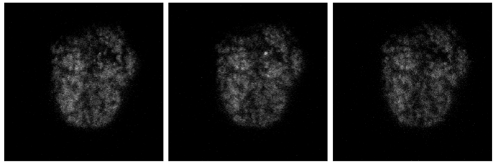
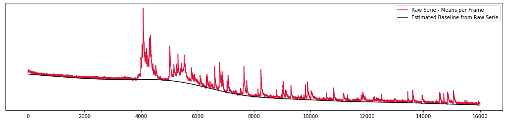
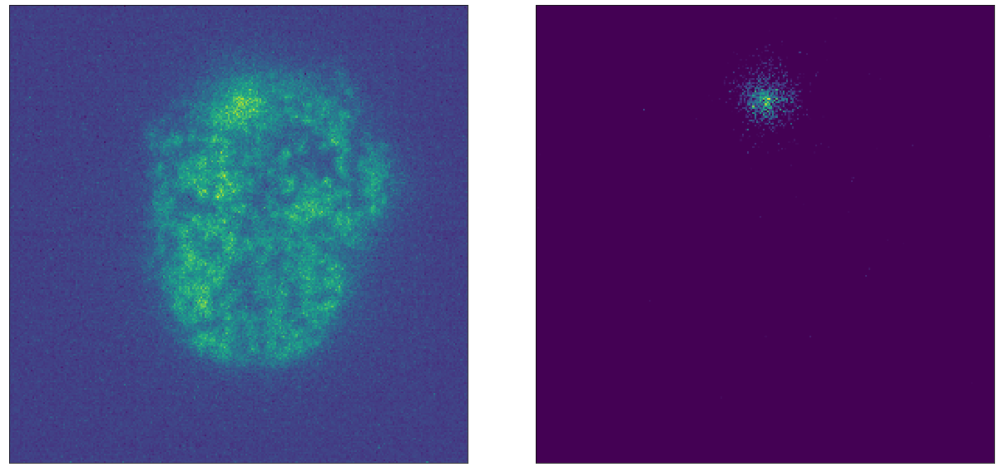
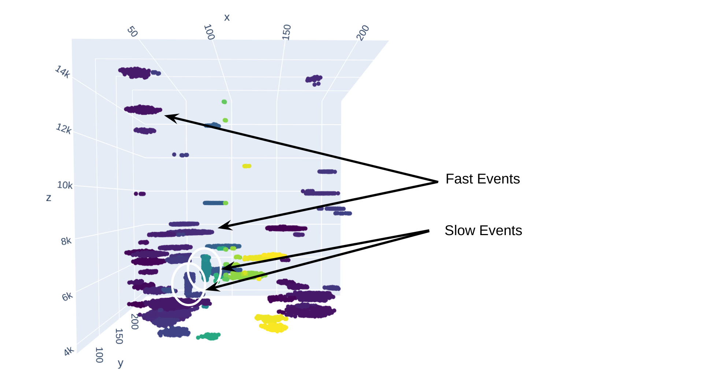

`Authors: Alex Nguyen, Brian Roach, Pengcheng Zhang, Meryll Dindin`

## Set up your environment:

```bash
git clone https://github.com/Coricos/ExoSpytosis.git
virtualenv -p python3 ExoSpytosis
cd ExoSpytosis
source bin/activate
pip install -r requirements.txt
```

## For Jupyter users, add the environment to your kernels:

```bash
pip install jupyter notebook ipython ipykernel
python -m ipykernel install --user --name=exospytosis
```

## What we aim at solving:



Using fluorescent false neurotransmitters (FFNs), which are fluorescent analogs of natural ("true") neurotransmitters, we are able to label vesicles in live cells with enough signal to permit imaging at high frequencies (up to 800 Hz).

The methods provided here are designed to automatically detect exocytosis events in live cell recordings.

## Current methodology:

* First step is about determining the baseline (signal decomposition and reconstruction) to quantify the intensity decay over time.



* Second step is about building a blurry mask to remove the background on each frame.



* Final step do target event reconstruction based on obtained points of interest, through the multiprocessed extraction of those points of video chunks (memory and time efficient), inputed into a KDTree to build a connected graph based on a mixed metric (accounting for both spatial and temporal resolutions). The graph is post-processed through unsupervised labeling (pure distance metric), and events considered close enough are fusionned. The final visualization is presented here under.

