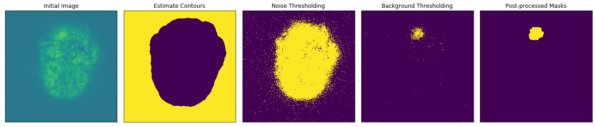
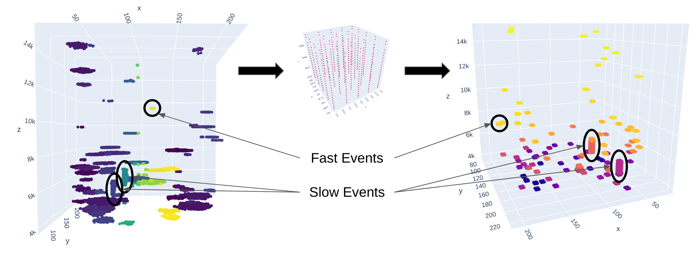

`Authors: Alex Nguyen, Brian Roach, Pengcheng Zhang, Meryll Dindin`

## Set up your environment:

```bash
git clone https://github.com/Coricos/ExoSpytosis.git
virtualenv -p python3 ExoSpytosis
cd ExoSpytosis
source bin/activate
pip install -r requirements.txt
```

## For Jupyter users, add the environment to your kernels:

```bash
pip install jupyter notebook ipython ipykernel
python -m ipykernel install --user --name=exospytosis
```

## What we aim at solving:

Using fluorescent false neurotransmitters (FFNs), which are fluorescent analogs of natural ("true") neurotransmitters, we are able to label vesicles in live cells with enough signal to permit imaging at high frequencies (up to 800 Hz). The methods provided here are designed to automatically detect exocytosis events in live cell recordings.


## Current methodology:

* **First step**: The algorithm determines the noise levels over time to quantify temporal decay. It is done through the masking of frames to extract the cell and keep the background noise. This single quantification allow us to precisely threshold noise levels, and thus enhance signal over noise ratio.

* **Second step**: Estimates the background based on a selection of the beginning of the video, determined as static.

* **Third step**: Apply background subtraction and noise thresholding in each frame. This method has been made independent to open the door to multi-processing, and thus memory-efficiency and time-efficiency as well.



* **Fourth step**: Based on the extracted point of interest, a 3D mask is available to represent the high intensity zones of the video. The question was then about being robust to cell movement, and possible sparse zones due to the thresholding techniques. The methodology here is to actually expand each pixel to its closest neighboars, and use a density-based clustering approach. This gives us an annotated 3D mask with clusters, considered as independent events.

* **Fifth step**: It becomes then necessary to filter those events due to unexpected behavior of false positives. To do so, we first compute the convex hull of each cloud point relative to each event. This gives us access to area and volume metrics, which are used to delete events that would be too small to be even considered. We then enhance and reclaim the zones of interest by using the centroids of the obtained events, and building the 5x5 ROI as used by the statistical approach so far.

