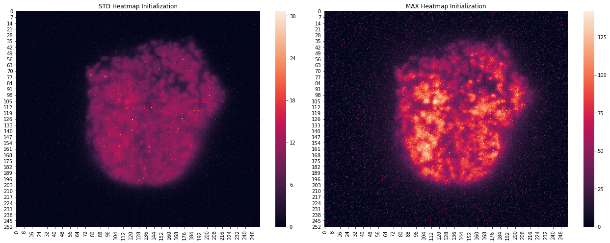
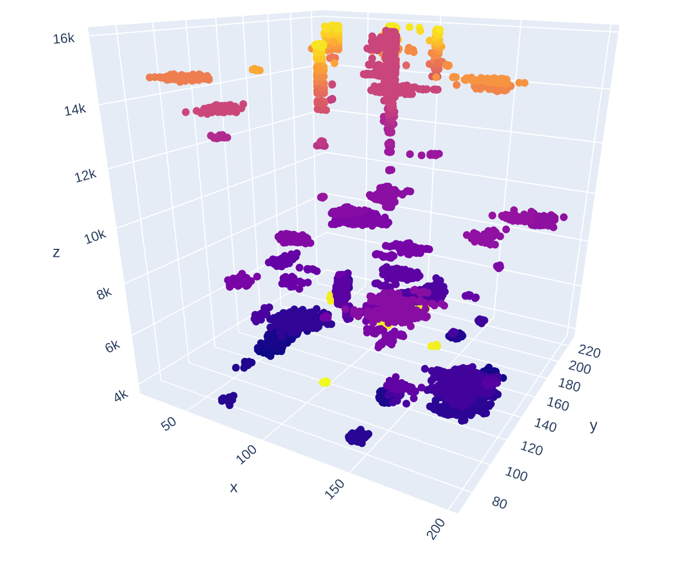
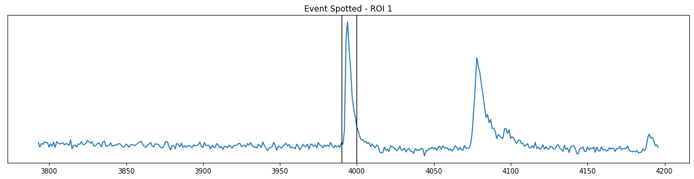

`Authors: Alex Nguyen, Brian Roach, Pengcheng Zhang, Meryll Dindin`

## Set up your environment:

```bash
git clone https://github.com/Coricos/ExoSpytosis.git
virtualenv -p python3 ExoSpytosis
cd ExoSpytosis
source bin/activate
pip install -r requirements.txt
```

## For Jupyter users, add the environment to your kernels:

```bash
pip install jupyter notebook ipython ipykernel
python -m ipykernel install --user --name=exospytosis
```

## What we aim at solving:


## Current methodology:







